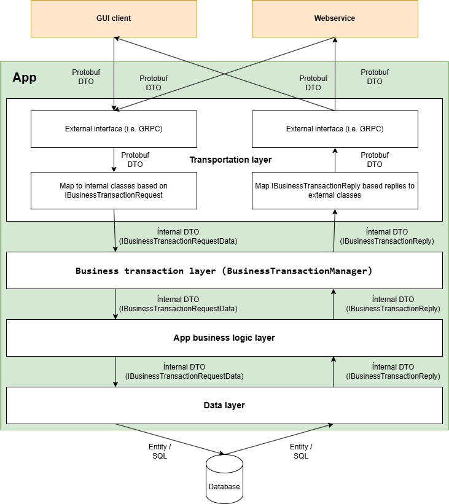

# Business transactions with IBusinessTransactionManager / BusinessTransactionManager 

## Overview

A business transaction is defined here as an external call for a certain functionality of an app by a UI client, webservice or any other client of the app. BusinessTransactionManager class is intended as central point for inbound business transactions for the app. At least each external call via technologies like GRPC or Webservice should be a business transaction.

BusinessTransactionManager delivers central features like logging and performance measurement to external request to your app. So it helps to simplify external interface classes using technologies like GRPC, WebAPI or Webservice by keeping business logic out of them.

Imaging you have to develop an server app based on a database. The server app has a GUI and a separate webservice app connected via GRPC as transportation technology. The transportation layer is accessing directly the business logic layer. 

With a well disciplined dev team this is no big deal. It maps the Protobuf DTO coming from GUI or webservice to an internal DTO and forwards it to the business logic. 


The approach of accesing business logic directly from transportation layer will work well basically but has some drawbacks in every case:

-   You have to implement a GRPC related method in the transportation for each separate request. This blows up the source code and is expensive for resssources like RAM
-   Request logging has to be done in each of this GRPC related request methods separately
-   Handling request meta data like ClientId or User has to be done in each of this GRPC related request methods separately
-   With an unexperienced dev team the danger of having transportation layer dependencies like GRPC spread all over the source code is growing
-   With an unexperienced dev team the danger of having buisness logic implemented directly in transportation layer is growing


All of the above points lead to uncessary source code to be maintained and shrinking testabililty up to untestability. 

Using business transactions addresses all of the above points.

-   You need only one GRPC method for receiving the business transaction request
-   Central handling of logging and basic error handling
-   Central handling of request meta data like ClientId or User
-   Clear separation of business logic layer and transportation layer
-   Lightweight implementation of the business transaction layer



Business transaction can be used app internally too.

For short running business transactions the GRPC request can directly wait for an answer. This is a syncronous working behavior.

For longer running business transactions it is potentially possible to implement a back channel to the client or webservice via GRPC and provide the result of the business transaction with its unique ID. With this ID the receiver can handle the result correctly as it is possible to nake a relation between the original request and the late coming reply. This is an asyncronous working behavior.

## Base class BusinessTransaction

Base class for business transactions is the class BusinessTransaction with the main properties Id, Name and RunBusinessTransactionDelegate.

RunBusinessTransactionDelegate is the binding member from business transactions to the business logic.

``` csharp

/// <summary>
/// Represents a business transaction that can be called from a client the current app
/// </summary>
public class BusinessTransaction
{
    /// <summary>
    /// A unique transaction ID. Transaction are called by this ID by the client
    /// </summary>
    public int Id { get; set; }

    /// <summary>
    /// Name of the transaction
    /// </summary>
    public string Name { get; set; }

    /// <summary>
    /// Error code the transaction should return. Default: 0 means no error 
    /// </summary>
    public int ErrorCode { get; set; } = 0;

    /// <summary>
    /// The error message the transaction should return
    /// </summary>
    public string ErrorMessage { get; set; }

    /// <summary>
    /// The business logic method that should be called for the current transaction
    /// </summary>
    public RunBusinessTransactionDelegate RunBusinessTransactionDelegate { get; set; }

    /// <summary>
    /// Do not add an event counter for this transaction
    /// </summary>
    public bool NoEventCounter { get; set; } = false;

}

```

## Sample implementation of a business transaction provider

An app using the business transactions should define a set of IBusinessTransactionProvider based classes providing the logic for the required business transactions. 
This set of providers has to be loaded once  with the method AddProvider() to the BusinessTransActionManager class on app start.


``` csharp

internal class TestTransactionProvider: IBusinessTransactionProvider
{
    /// <summary>
    /// A dictionary containing delegates for creating business transactions.
    /// The key of the dictionary is the int tarnsaction ID
    /// </summary>
    public Dictionary<int, CreateBusinessTransactionDelegate> CreateBusinessTransactionDelegates { get; } = new();

    public SampleBusinessLogicLayer SampleBusinessLogic { get; } 


    public TestTransactionProvider()
    {
        SampleBusinessLogic = new SampleBusinessLogicLayer();

        CreateBusinessTransactionDelegates.Add(1000, CreateTnr1000);
    }

    private BusinessTransaction CreateTnr1000()
    {
        return new BusinessTransaction
        {
            Id = 1000,
            Name = "Testtransaction",
            RunBusinessTransactionDelegate = SampleBusinessLogic.EmptyRequest
        };
    }
}

```

Here a simple example how to setup and to use the business transactions:

``` csharp

// Arrange 
var aes = TestHelper.CreateAppEventSource();

const int transactionId = 1000;
var m = new BusinessTransactionManager(_logger, aes);
var p = new TestTransactionProvider();

m.AddProvider(p);

IBusinessTransactionRequestData requestData = new EmptyBusinessTransactionRequestData();

// Act  
var t = m.RunBusinessTransaction(transactionId, requestData);

// Assert
Assert.That(t, Is.Not.Null);
Assert.That(m.TransactionCache, Has.Count.EqualTo(1));
Assert.That(t.RequestData, Is.EqualTo(requestData));

```
